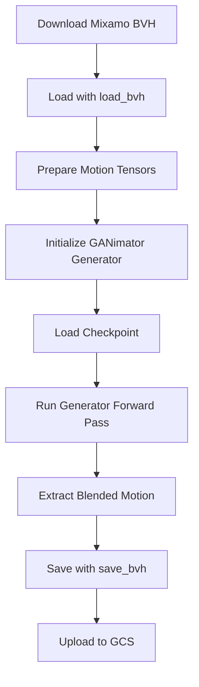

# Blendanim Framework Integration Guide

## Overview

The [blendanim](https://github.com/RydlrCS/blendanim) framework provides **controllable single-shot animation blending** using GANimator (GAN-based motion synthesis) with temporal conditioning. This guide explains how to integrate it with the mixamo-blend-pipeline.

## Important Notes

**blendanim is a PyTorch deep learning framework**, not a simple Python library. Integration requires:

- **PyTorch 1.13+** with CUDA support (GPU strongly recommended)
- **moai framework** (https://github.com/moverseai/moai) - Deep learning utilities
- **Pre-trained GANimator checkpoints** - Not publicly available in the repository
- **Significant compute resources** - Model training and inference are GPU-intensive

## Current Implementation Status

The `src/blender/` module in this repository provides a **placeholder interface** that:

- ✅ Documents the expected API for motion blending
- ✅ Provides type-safe function signatures with comprehensive docstrings
- ✅ Validates input parameters and file paths
- ❌ **Does NOT implement actual blending** (requires full blendanim integration)

## Architecture Overview

### blendanim Components

```
blendanim/
├── src/
│   ├── components/
│   │   ├── ganimator.py          # Generator & Discriminator models
│   │   └── gamimator_old.py      # Legacy implementation
│   ├── data/
│   │   ├── bvh.py                # BVH dataset loader
│   │   └── load_bvh.py           # BVH parsing utilities
│   ├── exporters/
│   │   ├── bvh.py                # BVH export function
│   │   └── bvh_exporting/        # BVH writing utilities
│   ├── monads/
│   │   ├── feature_extractors/   # Movement encoders
│   │   ├── geometry/             # Rotation conversions
│   │   └── utils/                # Demux, SMPLH, SPADE, FiLM
│   └── metrics/                  # Diversity, coverage metrics
```

### Key Classes

#### 1. Generator (GANimator)

```python
from src.components.ganimator import Generator

generator = Generator(
    parents=[...],          # Joint hierarchy (parent indices)
    contacts=[...],         # Foot contact joint indices
    kernel_size=15,         # Conv kernel size
    padding_mode='reflect', # Padding strategy
    bias=True,              # Use bias in convolutions
    stages=2                # Number of generation stages
)

# Forward pass
output = generator(
    noise0=noise_tensor,        # Stage 0 noise (B, C, T0)
    generated=source_motion,    # Source motion tensor (B, C, T)
    skeleton_id_map=skel_map,   # Skeleton ID map for SPADE
    noise1=target_motion        # Stage 1 target motion (B, C, T1)
)

# Returns: {'stage0': tensor, 'stage1': tensor}
```

#### 2. BVH Loading

```python
from src.data.load_bvh import load

positions, rotations, offsets, parents, names, frametime = load("walk.bvh")

# Returns:
# - positions: (frames, 3) - Root position trajectory
# - rotations: (frames, joints, 3) - Euler angle rotations
# - offsets: (joints, 3) - Joint offset vectors
# - parents: (joints,) - Parent joint indices
# - names: List[str] - Joint names
# - frametime: float - Frame timestep (1/fps)
```

#### 3. BVH Saving

```python
from src.exporters.bvh_exporting.bvh_utils import save

save(
    path="output.bvh",
    frames=150,
    timestep=1.0/30.0,
    names=['Hips', 'Spine', ...],
    parents=np.array([-1, 0, 1, ...]),
    offsets=np.array([[0, 0, 0], ...]),
    rotations=np.array([[...]]),  # (frames, joints, 3)
    position=np.array([[...]]),   # (frames, 3)
    precision=6
)
```

## Integration Steps

### Step 1: Install Dependencies

```bash
# Create fresh environment
conda create -n blendanim python=3.10
conda activate blendanim

# Install PyTorch with CUDA
conda install pytorch torchvision torchaudio pytorch-cuda=11.8 -c pytorch -c nvidia

# Install moai framework
pip install moai

# Install additional dependencies
pip install numpy scipy matplotlib
```

### Step 2: Clone and Setup blendanim

```bash
# Clone the repository
git clone https://github.com/RydlrCS/blendanim.git
cd blendanim/single-shot-blending

# Install in editable mode
pip install -e .
```

### Step 3: Obtain Pre-trained Checkpoints

The blendanim repository does **not include pre-trained checkpoints**. You will need to:

**Option A: Train from scratch**
- Requires Mixamo motion dataset (100GB+)
- Training takes days/weeks on multi-GPU setup
- Follows GANimator training procedure

**Option B: Request checkpoints from authors**
- Contact repository maintainers
- May require academic collaboration agreement

**Option C: Use alternative checkpoints**
- Adapt from GANimator official implementation
- Requires architecture compatibility verification

### Step 4: Implement Blending Wrapper

Replace the placeholder in `src/blender/blender.py`:

```python
import torch
import numpy as np
from pathlib import Path
from src.data.load_bvh import load as bvh_load
from src.exporters.bvh_exporting.bvh_utils import save as bvh_save
from src.components.ganimator import Generator

def load_bvh(file_path: str, fps: int = 30, scale: float = 1.0):
    """Load BVH file using blendanim."""
    positions, rotations, offsets, parents, names, frametime = bvh_load(file_path)
    
    # Apply scaling
    positions *= scale
    offsets *= scale
    
    # Resample if needed
    original_fps = 1.0 / frametime
    if abs(original_fps - fps) > 0.1:
        # Implement resampling logic
        pass
    
    return {
        'positions': positions,
        'rotations': rotations,
        'offsets': offsets,
        'parents': parents,
        'names': names,
        'frametime': frametime
    }

def save_bvh(output_path: str, positions, rotations, offsets, 
             parents, names, fps: int = 30, scale: float = 1.0):
    """Save motion data to BVH."""
    frame_count = rotations.shape[0]
    timestep = 1.0 / fps
    
    bvh_save(
        str(output_path),
        frame_count,
        timestep,
        names,
        parents,
        offsets * scale,
        rotations,
        positions * scale,
        precision=6
    )
    return True

def blend_motions(config: BlendConfig, output_path: str) -> BlendResult:
    """Actual blending implementation."""
    start_time = time.time()
    
    # Load motions
    source_data = load_bvh(config.source_animation, config.fps, config.scale)
    target_data = load_bvh(config.target_animation, config.fps, config.scale)
    
    # Initialize model
    device = torch.device('cuda' if torch.cuda.is_available() else 'cpu')
    generator = Generator(
        parents=source_data['parents'].tolist(),
        contacts=[16, 17, 20, 21],  # Typical foot joints
        kernel_size=15,
        padding_mode='reflect',
        bias=True,
        stages=2
    ).to(device)
    
    # Load checkpoint
    if config.checkpoint_path:
        checkpoint = torch.load(config.checkpoint_path, map_location=device)
        generator.load_state_dict(checkpoint['generator'])
    
    generator.eval()
    
    # Prepare tensors (simplified - actual preprocessing is complex)
    source_tensor = prepare_motion_tensor(source_data)
    target_tensor = prepare_motion_tensor(target_data)
    skeleton_id_map = create_skeleton_id_map(source_data)
    
    # Generate blend
    with torch.no_grad():
        blended = generator(
            noise0=torch.randn_like(source_tensor),
            generated=source_tensor,
            skeleton_id_map=skeleton_id_map,
            noise1=target_tensor
        )
    
    # Extract and save result
    blended_motion = blended['stage1'].cpu().numpy()
    positions, rotations = extract_motion_from_tensor(blended_motion, source_data)
    
    save_bvh(
        output_path,
        positions, rotations,
        source_data['offsets'],
        source_data['parents'],
        source_data['names'],
        config.fps,
        config.scale
    )
    
    duration = time.time() - start_time
    return BlendResult(
        success=True,
        output_path=output_path,
        blend_config=config,
        frame_count=rotations.shape[0],
        duration_seconds=duration
    )
```

### Step 5: Implement Motion Tensor Preprocessing

The GANimator model requires specific tensor format:

```python
def prepare_motion_tensor(motion_data: dict) -> torch.Tensor:
    """
    Convert BVH motion data to GANimator tensor format.
    
    GANimator expects: (B, C, T) where:
    - B: Batch size (typically 1)
    - C: Channels = (joints + contacts + 1) * 6
    - T: Temporal frames
    
    Channel composition:
    - Joint rotations (6D representation)
    - Root position (3D)
    - Foot contacts (binary labels)
    """
    # Convert Euler to 6D rotation representation
    rotations_6d = euler_to_6d(motion_data['rotations'])
    
    # Extract root trajectory
    root_position = motion_data['positions']
    
    # Compute foot contacts
    foot_contacts = compute_foot_contacts(
        motion_data['positions'],
        joint_indices=[16, 17, 20, 21]
    )
    
    # Concatenate all features
    motion_tensor = torch.cat([
        rotations_6d,
        root_position,
        foot_contacts
    ], dim=-1)
    
    # Reshape to (B, C, T)
    motion_tensor = motion_tensor.permute(0, 2, 1)
    
    return motion_tensor
```

## Workflow Summary



## Limitations

### Current Challenges

1. **No public checkpoints** - Must train from scratch or request from authors
2. **Complex preprocessing** - Motion tensor format requires deep understanding
3. **GPU dependency** - CPU inference is impractically slow
4. **Data requirements** - Training needs 100GB+ of Mixamo motions
5. **Documentation gaps** - Repository lacks usage examples and tutorials

### Recommended Alternative Workflow

For production use **without** blendanim integration:

1. **Manual blending** in Blender/MotionBuilder
   - Use downloaded Mixamo animations
   - Create transitions manually
   - Export to GCS

2. **Keyframe interpolation** (simpler approach)
   - Linear interpolation between end/start poses
   - Slerp for rotation quaternions
   - No deep learning required

3. **Contact authors** for collaboration
   - Academic research partnership
   - Shared checkpoint access
   - Technical support

## References

- [blendanim Repository](https://github.com/RydlrCS/blendanim)
- [GANimator Paper](https://arxiv.org/abs/2203.16051) - Original GAN-based motion synthesis
- [moai Framework](https://github.com/moverseai/moai) - Required dependency
- [PyTorch Documentation](https://pytorch.org/docs/stable/index.html)

## Support

For blendanim-specific questions:
- Open issue in [RydlrCS/blendanim](https://github.com/RydlrCS/blendanim/issues)
- Contact repository maintainers

For mixamo-blend-pipeline integration:
- See [README.md](../README.md)
- Check [docs/MIXAMO_INTEGRATION.md](MIXAMO_INTEGRATION.md)
